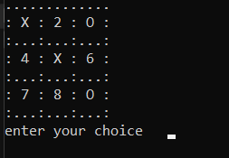
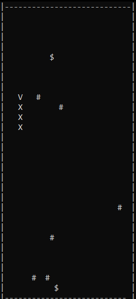

# 🐍 Snake and Tic Tac Toe in C++  
A C++ implementation of **Snake** and **Tic Tac Toe** without OOP or pointers, developed as a final project for an introductory programming course. 




---

## 🎮 Features  
### **Snake Game**  
- Arrow-key controls (`↑`, `↓`, `←`, `→`).  
- Configurable game speed and obstacle counts.  
- Score tracking via snake length growth.  

### **Tic Tac Toe**  
- **PvP Mode**: Two players take turns.  
- **AI Opponent**:  
  - **Easy Mode**: Random moves.  
  - **Hard Mode**: Minimax-like logic to block wins and force wins.  
- Visual grid with numbered positions (1–9).  

---

## 🛠️ Code Structure  
```plaintext
- main.cpp            
- snake/              
  - snake.cpp      
  - snake.h
  - snake_gameplay.png      
- tictactoe/          
  - tictactoe.cpp          
  - tictactoe.h
  - tictactoe_gameplay.png
```

## 🚀 How to Compile & Run   
```bash
g++ main.cpp snake/snake.cpp tictactoe/tictactoe.cpp -o game
```


